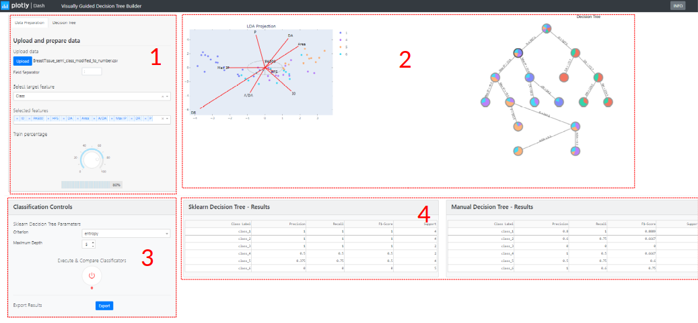
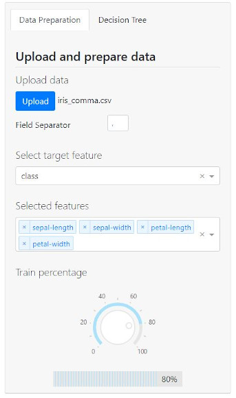
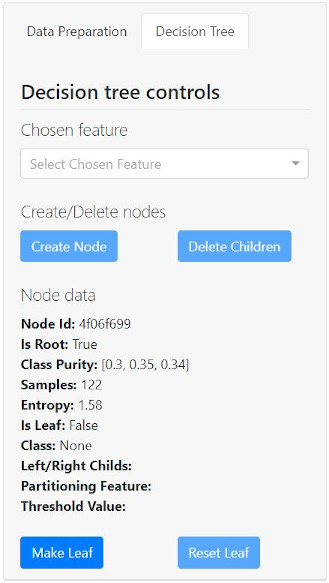
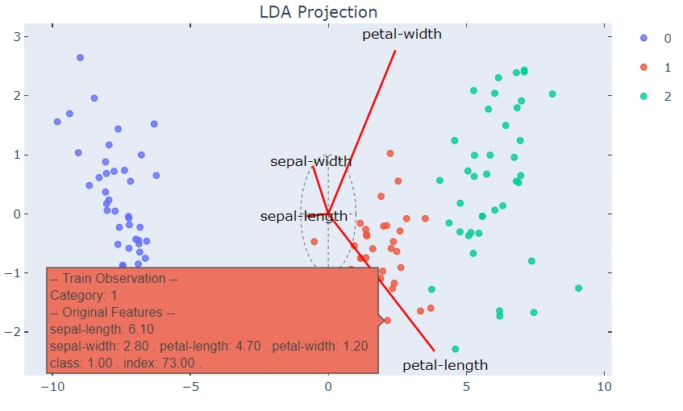
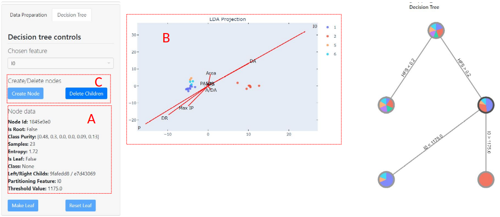
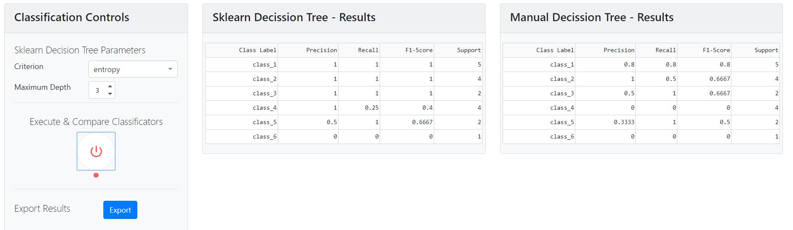

# Tool for manually build a decision tree
> This tool is the final project for a Master's Thesis for a Data Science Master. The tool has been designed using Plotly Dash 1.9.1 in Python 3.7.

## Table of contents
* [Executive Summary](#executive-summary)
* [Theory Behind The Tool](#theory-behind-the-tool)
* [Interface Description](#interface-description)
* [References](#references)

## Executive Summary
The idea for the current Master Thesis comes from the work described in the investigation paper ‘Visually guided classification trees for analyzing chronic patients’ [[1]](#references). The goal of the designed tool is to manually generate, in a visually guided manner, a decision tree for an n-dimensioned dataset. The user will build the different tree nodes leveraging on a data visualization based on the combination of Star Coordinates (SC) [[2]](#references) and Linear Discriminant Analysis (LDA) [[3]](#references) techniques.

The tool has a web interface to process and load data, to visualize it in two dimensions using SC and LDA, to create and visualize a decision tree and, finally, to benchmark some of the main parameters of the classification results executed by the decision tree manually built by the user and another one automatically generated by the ***DecisionTreeClassifier*** [[4]](#references) class of the ***tree*** [[5]](#references) module from the ***Sklearn*** [[6]](#references) Python library. Besides, the tool has an export module that allows the user to have a PDF-based graphical representation of the two decision trees.

The tool has been entirely designed using ***Dash*** [[7]](#references). Written over ***Flask*** [[8]](#references), ***Plotly.js*** [[9]](#references) and ***React.js*** [[10]](#references), Dash is suitable to create data visualization dashboards with highly customized user interfaces using just Python.

## Theory behind The Tool

The Master's Thesis as part of which this tool was developed is also included in the repo (TFM_Fausto_Blasco.pdf) although there is only a Spanish version of it. All the details about the fundamentals that are behind the tool are deeply described in the document. However, here I'm describing the basic idea for the tool.

There are many different visualization methods for multidimensional data. Some of them, like Principal Component Analysis (PCA) or Linear Discriminant Analysis (LDA), are linear projection methods normally used for problem dimensionality reduction. Other methods, however, do not aim to reduce data dimensionality for their visualization, but they try to project the initial dimensionality of the data to a visualization in which all the variables are somehow represented. This is the case for methods like parallel coordinates, star coordinates (SC) or radar graphs. In all of them you can compare the different variables and the relationship between them.

In this tool we have chosen to use a dimensionality reduction visualization method so the n-dimensional space of the variables is represented in a two-dimensional or unidimensional space. This representation is built based on the combination of the representation using SC and LDA. LDA allows us to  project samples, from their n-dimensional space, to a two-dimensional space (or unidimensional in some special cases) in a way that, in that space, the classes separation is maximized (also called inter-class variance) and also the dispersion of the samples inside a class is minimized (also called intra-class variance).

On the other hand, SC is a visualization method for multidimensional data that also generates linear projections of the data from n-dimensional space into a two-dimensional space. In particular, SC builds the points that represent each sample by making use of a set of vectors as an axis where each of those vectors is related to each of the variables of the sample. The orientation of each axis shows the direction in which that variable grows and its size is related to the contribution of that variable in the final representation. SC allows you to generate an arbitrary number of representations for a dataset just by modifying the axis. 

This can be used to match the representation of the data using SC with any projection given by any linear projection method used to take the data to a two-dimensional space, like LDA.

So, making use of the combination of SC and LDA, the tool's user can see a representation of the variables influence (SC axis) on the classes separation (LDA representation). In that way, and based on the tool's user field knowledge but also on the information given by the associated data representation, one can decide which variable will be used to partition the data space on each tree node and build, in that way, step by step and in a graphic way, the best decision tree that will combine both concepts.

## Interface Description

The four main tool parts are:
1. Data loading and tree building control part
2. Visualization area
3. Classification and exporting control part
4. Classifiers comparison tables

In the first area (Data loading and tree building control part) there are two tabs. The first one is for the data loading and the second one is for the tree building. In the next figure it can be seen a detailed view of the two of them:

 

In the second area of the interface is where the visualizations are shown. On one hand, we can see the projection of the data in the bidimensional space produced by the LDA in combination with the SC axes that result from making both projections to match.

As it can be observed in the following figure, the projection of the samples belonging to each class are displayed in a different color, so we can better visualize the distribution in the projected space of the different classes.

In this same area the classifier tree is also shown. This tree is being built as long as the user chooses variables to partition the nodes based on them. As shown in the next picture the user can select a tree node (that will be highlighted in black) to:

* Show in the control area the associated data for this node (A)
* Show, in the LDA projection graph, the samples that fall into that node (B)
* Use the controls to create/delete nodes and to force/undo the node to become a leaf (C)

Finally, on the last areas we can observe the results once we have finished our own classifier tree. The tool will create a tree using ***Sklearn*** library and will execute classification of the test samples using both, the one created manually the one created by ***Sklearn***. On the result tables we will check how one tree performs against the other by comparing some figures like precision, recall and F-1 score. At this time you can also export a PDF version of both trees by clicking on the "Export" button.

## References
1. Soguero-Ruiz et al. BMC Bioinformatics 2020, 21(Suppl 2):92. Visually guided classification trees for analyzing chronic patients.
2. Kandogan E. Star coordinates: A multi-dimensional visualization technique with uniform treatment of dimensions. In: Proceedings of the IEEE Information Visualization Symposium, Late Breaking Hot Topics. New Yersey: IEEE Computer Society; 2000. p. 9–12.
3. [https://en.wikipedia.org/wiki/Linear_discriminant_analysis](https://en.wikipedia.org/wiki/Linear_discriminant_analysis)
4. [sklearn.tree.DecisionTreeClassifier [Online] (Marzo 2020)](https://scikit-learn.org/stable/modules/generated/sklearn.tree.DecisionTreeClassifier.html?highlight=decisiontree#sklearn.tree.DecisionTreeClassifier)
5. [sklearn.tree: Decision Trees [Online] (Marzo 2020)](https://scikit-learn.org/stable/modules/classes.html#module-sklearn.tree)
6. [Scikit-Learn Machine Learning in Python [Online] (Marzo 2020)](https://scikit-learn.org/stable/)
7. [Dash User Guide [Online] (Marzo 2020)](https://dash.plotly.com/)
8. [Flask Web development, one drop at a time [Online] (Marzo 2020)](https://flask.palletsprojects.com/en/1.1.x/)
9. [Plotly JavaScript Open Source Graphing Library [Online] (Marzo 2020)](https://plotly.com/javascript/)
10. [React Una biblioteca de JavaScript para construir interfaces de usuario [Online] (Marzo 2020)](https://es.reactjs.org/)
